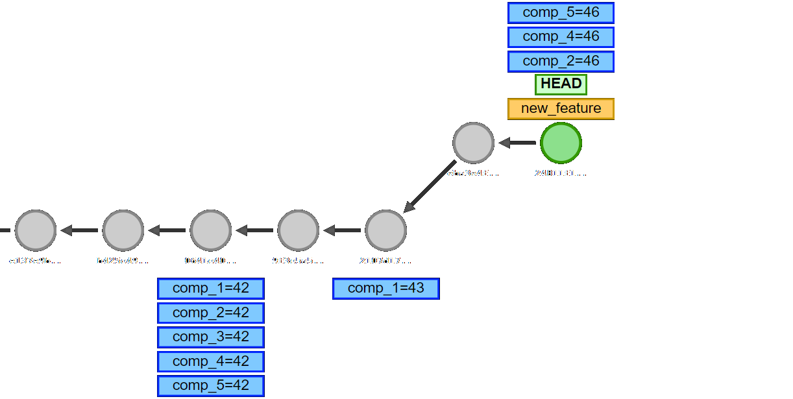
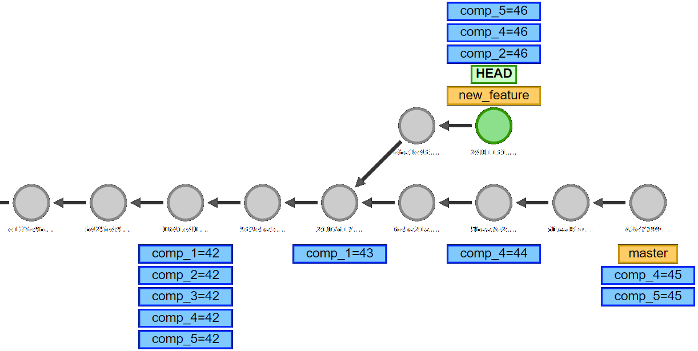

---
author-meta:
  - Wesley Yarde
date-meta: November 30, 2021
pagetitle: How (not) to store build metadata in Git
url-gh: https://github.com/wyarde
url-gino-keva: https://github.com/philips-software/gino-keva
url-demo: https://github.com/wyarde/talk-store-build-metadata-in-git/tree/demo
url-talk: https://wyarde.github.io/talk-store-build-metadata-in-git
major-minor-patch: MAJOR.MINOR.PATCH
build-metadata: BUILD METADATA
arrow-both: ⇄
arrow-left: ⇇
arrow-right: ⇉
---

##       $pagetitle$ {data-background-image="images/devopscon.jpg" data-background-size="contain" }

\
DevOpsCon ~~Munich~~ Online\
$date-meta$

## What is build metadata

:::: {.element: class="fragment" data-fragment-index="1"}

Build metadata is fancy for build ID.

::::

:::: {.element: class="fragment" data-fragment-index="2"}

It identies a build and the artifacts it generates.

::::

::: notes

Artifacts could be:

- Container
- Package

:::

## Spoiler

::: notes

- How to store
- How to use build metadata to create a component-based CI/CD pipeline
- Components are built independent, each with their own artifact
- Only rebuild what has changed

:::
## $author-meta$

|  {width=40%}  |
| :---------------------------------: |
|             <$url-gh$>              |
|       Senior Devops Engineer        |
| {width=50px} |

## Disclaimers

### This talk

> - Uses fancy words
> - is opinionated
> - includes a live demo

::: notes

- Uses fancy words to make up for my lack of confidence
- State my opinion as facts. I believe it will trigger more reaction/thinking

:::

### You need a basic understanding of

- Git
- Containers
- Build pipelines
- (my) Humour

### ... in life!

## Versioning

::: {.container}
:::: {.col .element: class="fragment" data-fragment-index="1"}
$major-minor-patch$

- Describes public API
- Incremented manually
- Relatively static
::::

:::: {.col .element: class="fragment" data-fragment-index="2"}
$build-metadata$

- Links artifacts to commits
- Determined by the system
- Changes all the time
::::
:::

:::: {.element: class="fragment" data-fragment-index="3"}
\
Semantic Versioning 2.0.0 - https://semver.org
::::

::: notes

Versioning of Artifacts:

Major.minor.patch:

- External
- Stored in

  - versionInfo.json (old school)
  - Git tag

Build metadata:

- Internal
- Where and how to store?

:::

## Why link artifacts to commits?

\
commit $arrow-both$ artifacts

::: notes

Two reasons; we're going to look at arrows in both directions

:::

### For traceability

> - commit $arrow-left$ artifacts
> - 💤 Boring 💤

::: notes
Traceability means you can always find the version of code for any artifact/release/installer/installation. In open source, this concept is not that important anymore since distribution of build output is just for convenience
:::

### Keep track of all moving parts

> - commit $arrow-right$ artifacts
> - Only build what changed
> - 🎈 Fun! 🎈

::: notes

Historically, not all that exciting. Every change requires a build anyway.
It's fun, especially with multiple parts as will see

:::

## Multiple moving parts

:::: {.element: class="fragment" data-fragment-index="1"}
New feature, build 46
::::

:::: {.element: class="fragment" data-fragment-index="2"}

::::

::: notes

Determine changes:

- Identifies what has changed

Build:

- Each component has an independent build, which can run in parallel
- Also run tests for each component
- Output is a docker container

Release:

- Collect all containers
- Release them

:::

### Git history {data-transition="slide-in fade-out"}

### Git history {data-transition="fade"}

### Git history {data-transition="fade"}

## Let's do IT!

1. Where to store it
2. How to manipulate it

### 1. Where?

> - In Git
> - ...but not in commits
> - Git tags?
> - Git notes!

{width=60%}

::: notes

- Using versionInfo.json here is a very silly idea
- Since one end of the link is a git commit, storing in git makes a lot of sense
- A commit would be horrible; it pollutes the history and doesn't even work
- Tags have 2 drawbacks: Explosion of tags and doesn't support concurrent use
- Git notes are perfect!

:::

### Git notes

_Supplement a commit message without changing the commit itself_

- `git notes add|remove|show|list`
- Stored as commits in refs/notes/

### 2. How?

Gino Keva - A simple Git Notes Key Value store
<$url-gino-keva$>

>- Store key/values in a note
>- List key/values for a commit

::: notes

- Implemented using event sourcing pattern
- Create materialized view with all events

:::

## Demo

# End

|               This talk               |                 Demo                  |                    Gino Keva                    |
| :-----------------------------------: | :-----------------------------------: | :---------------------------------------------: |
|  |  |  |
